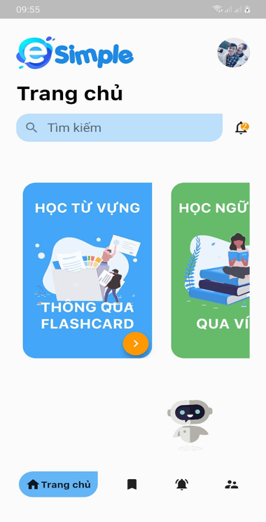

# Flutter Language - Ứng dụng Học tiếng anh bằng Flashcard eSimple

   
   Đây là ứng dụng Mobile mình viết - phục vụ cho đồ án Cơ sở ngành Công nghệ thông tin

Công cụ, Ngôn ngữ sử dụng:

-   Flutter

-   Firebase (Authentication & Realtime Database)

-   Wordpress

## **Đăng ký**

    Để sử dụng các chức năng của ứng dụng, yêu cầu bạn phải Đăng ký tài khoản và có các yêu cầu sau:
   
-   **TextField Họ và tên** * : Nhập tên bất kỳ
-   **TextField Địa chỉ Email** * : Nhập đúng định dạng Email: _ @ _
-   **TextField Mật khẩu** * : Nhập mật khẩu tối thiểu 6 ký tự
-   **TextField Nhập lại Mật khẩu** * : Nhập lại mật khẩu phải trùng khớp
-   **Button Action:** Tạo tài khoản
Lưu ý: Các mục (*) là yêu cầu bắt buộc nhập. Giả sử người dùng không hợp lệ sẽ có những ràng buộc và thông báo lỗi như sau:

## **Đăng nhập**

•	Đăng nhập bằng tài khoản Gmail người dùng đã đăng kí trước đó

•	Đăng nhập tài khoản bằng mạng xã hội giúp người dùng có nhiều sự lựa chọn nếu không muốn đăng kí một tài khoản mới.

•	Để sử dụng chức năng của ứng dụng, yêu cầu bạn phải đăng nhập tài khoản và có các yêu cầu sau:

+ 	TextField Địa chỉ Email * : Nhập đúng định dạngEmail: _@_ đã đăng kí trước đó
+	TextField mật khẩu * : Nhập đúng mật khẩu trên 6 kí tự đã đăng kí 

Lưu ý: các mục (*) là bắt buộc nhập, giả sử người dùng không hợp lệ sẽ có những ràng buộc và thông báo lỗi như sau:

## **Quên mật khẩu**

+	Nếu người dùng quên mật khẩu và có yêu cầu khôi phục lại mật khẩu hệ thống sẽ khôi phục lại mật khẩu cho người dùng bằng tài khoản Email đã đăng kí trước đó.

+	Khi click vào “quên mật khẩu” ở form đăng người dùng sẽ được đến form khôi phục mật khẩu. Người dùng chỉ cần nhập đúng Email đã đăng kí trước đó và click vào RadioButton xác nhận khôi phục là đã khôi phục thành công và chuyển về form trang chủ.
+	Trường hợp người dùng quên cả Email thì phải tạo một tài khoản mới để có thể sử dụng phần mềm.

## **Trang chủ**

+ Đây là màn hình chính của phần mềm có nhiều phương pháp học để người dùng lựa chọn. người dùng có thể chọn một chủ đề để học  
+ Người dùng có thể chuyển đổi tài khoản và thay đổi thông tin cá nhân ở phần Profile Setting 
+ Ở màn hình chính bên dưới góc phải có tích hợp một chatbot. Người dùng có thể trực tiếp nói chuyện với nó. Có thể tìm kiếm chủ đề muốn học, hay nghĩa của những từ vựng đã học, tìm kiếm lời bài hát, đặt câu hỏi bằng tiếng anh và chatbot sẽ trả lời.

## **Quản lý người dùng**

+ Đây là phần quản lý của người dùng. Người dùng có thể thay đổi tài khoản, cập nhật thông tin, hình ảnh của mình, theo dõi tiến trình học
+ Nếu có vấn đề gì về ứng dụng thì có thể gửi thư góp ý hoặc liên hệ trực tiếp để được hổ trợ.

## **Trang chọn chủ đề học từ vựng**

Đây là phần giao diện học từ vựng của ứng dụng. có nhiều chủ đề khác nhau để phong phú hơn kiến thức cho người dùng có trải nghiệm tốt hơn.

Sau khi người dùng click vào 1 chủ đề nào đó sẽ hiện ra một thẻ FlashCard:

+ Trong thẻ này gồm có: hình ảnh liên quan đến từ vựng sẽ được học, những từ vựng để người dùng lựa chọn từ vựng tương ứng với hình ảnh.

+ Sau khi hoàn thành xong một chủ đề người dùng sẽ làm một bài test trắc nghiệm tổng quan những kiến thức đã được học trước khi chuyển sang một chủ đề khác.  

+ Sau khi click vào thẻ FlashCard sẽ hiện ra một dòng phiên âm từ vựng đó và một button khi click vào sẽ nghe được phát âm của từ vựng đó:

## **Giao diện học phát âm tiếng anh**

Ở đây có các bài học dành cho người dùng. Các bài học đều có tiến độ theo dõi người dùng đã hoàn thành được bao nhiêu.

## **Giao diện tương tác phát âm tiếng anh với người dùng**

+ Người dùng có thể tiến hành luyện phất âm một đoạn văn hay một từ vựng bằng cách click vào button có hình “micro” 

+ Để dừng phát âm người dùng sẽ click vào button hình vuông bên cạnh button có hình “micro”

+ Sau khi đọc xong và dừng đoạn phát âm người dùng sẽ nghe lại giọng phát âm của mình xem đã đúng hay chưa bằng cách click vào button “play”

+ Sau khi nghe xong người dùng có thể xóa đoạn phát âm cũ bằng cách click vào button có hình chữ “X”. 

